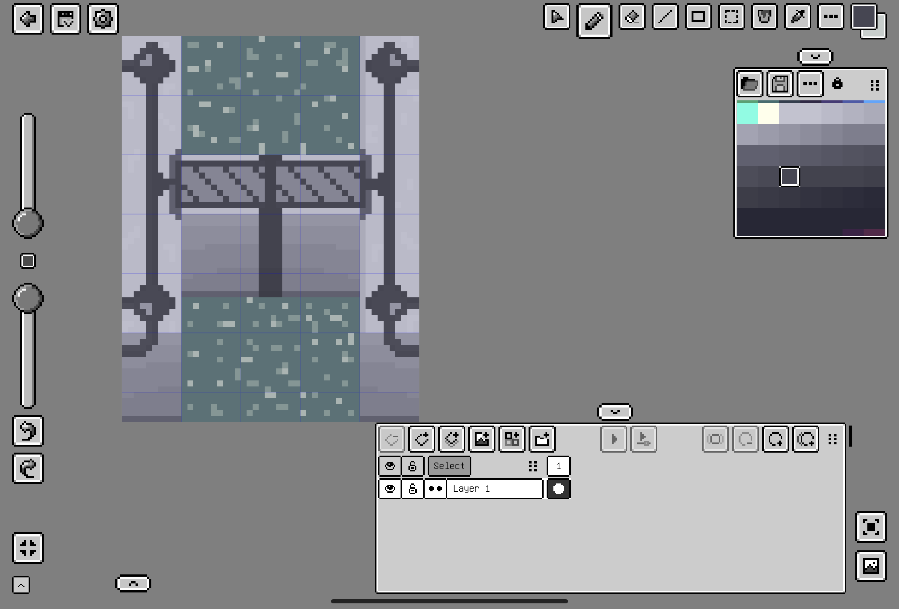
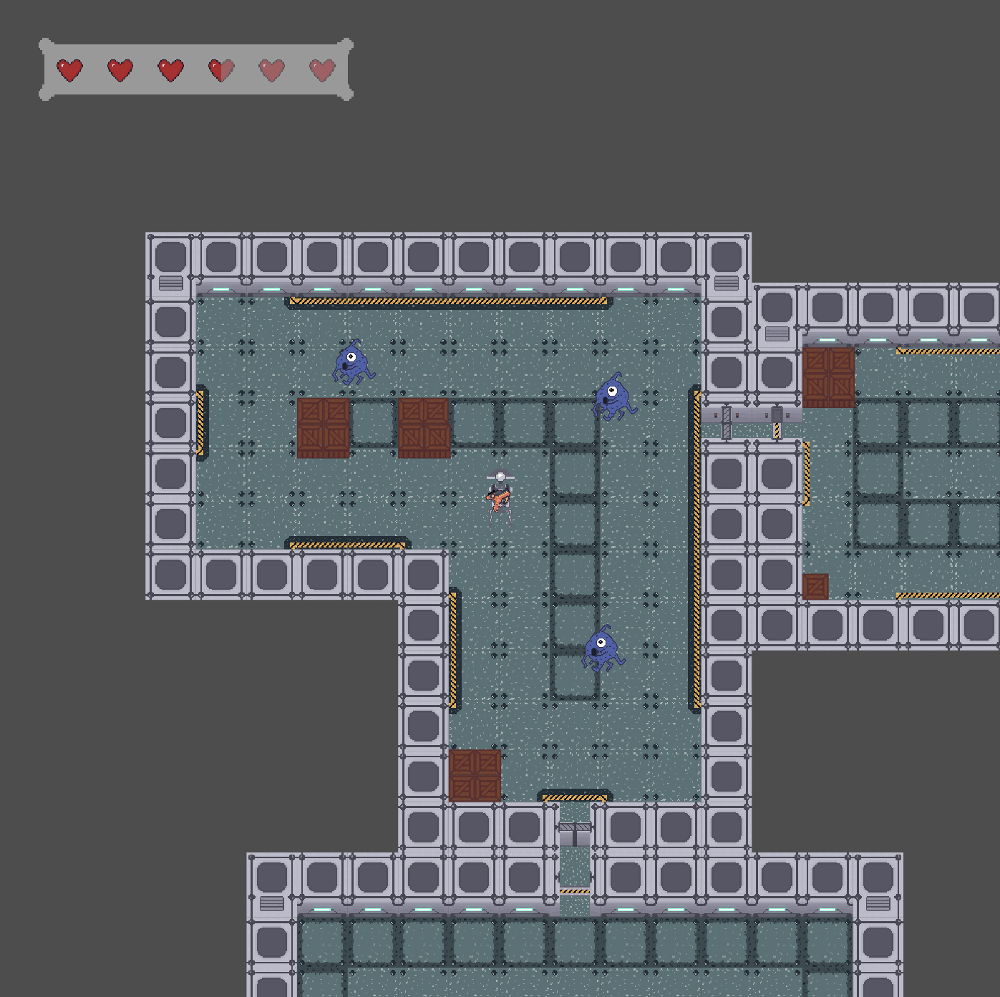
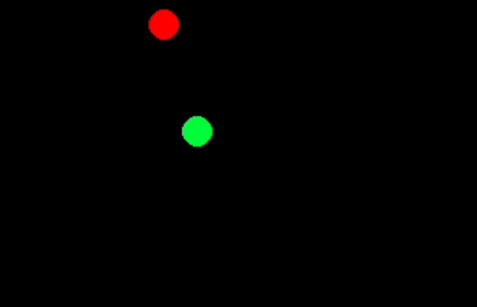

# Sprintlog 2

## Game Design

_[@weiserhase](https://github.com/uni-tj/robo-arena/commits?author=weiserhase) (Jan Keller), [@p-98](https://github.com/uni-tj/robo-arena/commits?author=p-98) (Timon Martins), [@JulesOxe](https://github.com/uni-tj/robo-arena/commits?author=JulesOxe) (Julius Oexle)_

We were quickly able to come up with a quite detailed idea of what our game should become:

- Rogue-Like
  - Procedural map generation
  - Round based, clear room to move on
  - Multiplayer coop, all vs the game
  - different enemy types
  - different weapons
  - different items (stat buffs, effect)
- Controls
  - Aim with mouse
  - Move with keyboard
- Configuration
  - config file
- graphics
  - 2.5D
  - tiled pixelart
  - player caries lightsource / corners are dark (optional)

### Minimum Viable Product

We quickly realized that we were getting lost in the details when brainstorming a game idea. That's why we decided on a set of features that should be included in a minimum viable product:

- gameplay
  - 1 player
  - 1 weapon type
  - 1 enemy type
- level generation
  - 3 different predefined rooms
  - rooms are randomely stitched together
  - easy room editing
- graphics
  - 1 type wall, floor, etc.
  - scale to screen
  - camera follows player
  - health bar
- sound
  - 1 type of sound for
    - movement
    - weapon
    - hit
    - death
    - background music
- networking
  - client hosts server deamon
- controls
  - move with keyboard
  - aim/shoot with mouse
- misc
  - death screen
  - start screen
  - option screen

From those ideas it became clear to us that we should deviate from the sprint tasks.
We wanted to first build up some of the components (multiplayer core, level generation, graphic design) seperately from each other to see them work and only stitch them together later.

## Graphic Design

_[@JulesOxe](https://github.com/uni-tj/robo-arena/commits?author=JulesOxe) (Julius Oexle)_

We have decided to create our ingame graphics ourselves, as our repository is public and we therefore avoid infringements of intellectual property rights. This also allows us to ensure that our game looks like a unified whole and that we have graphics available that fit our needs exactly.  
However, in order to keep the creation of graphics simple, we have opted for a pixel art style, which also fits well with the 2.5D style.

Various pixel editors were tried out. For example, the free [Pixilart](https://www.pixilart.com/) website. However, as the person responsible for creating the graphics, I wanted to work on my tablet, where I can draw better with a pen, so I opted for the [Pixquare](https://www.pixquare.art/) app.  
It offers a free mode in which you can create two graphics and try out the app. As I was impressed by the app, I bought the full version for €20, which gave me unlimited access to all features.

The app offers the following useful features:

- Pixel grid for easy orientation
- Creation of layers
- Color gradients for easy shading and details (see wall or floor)
- Practical folder system to store all designs in a clearly organized way
- The possibility to create animations (but I haven't had a close look yet)
- There are regular updates with new features (three in the last two weeks alone)

The app is very intuitive to use and is self-explanatory. To get started, I still recommend an [introductory video](https://www.youtube.com/watch?v=gPOTN7qE2OY) and you can look up individual features in the app's excellent [documentation](https://docs.pixquare.art/).

For inspiration, I first watched some gameplay from:

- [SoulKnight](https://play-lh.googleusercontent.com/cRQgr-V0tUIqocz7csI4_ampAODWpAxTUj8P8dRbpLLIyboheVl4W3jmEbq3Odiq28Y=w526-h296-rw)
- [The Binding of Isaac](https://static.fore.4pcdn.de/premium/Screenshots/63/be/92631784-vollbild.jpg)

Since these games were also designed in a 2.5D PixelArt style and I had to get a feeling for the player's perspective to know how to create the graphics.

Furthermore, I chose the following images as inspiration, which all have something to do with robots/aliens/spacestaion: [Floor](https://mir-s3-cdn-cf.behance.net/projects/404/f917f4102139819.Y3JvcCw0NzIsMzY5LDY3LDY1OQ.jpg), [Walls](https://assetsio.gnwcdn.com/starmancer-aliens.jpg?width=1200&height=1200&fit=bounds&quality=70&format=jpg&auto=webp), [Alien](https://img.freepik.com/vektoren-premium/pixel-art-illustration-alien-pixelated-alien-alien-kopf-pixelated-fuer-das-pixel-art-spiel-und-das-icon_1038602-911.jpg).

I have created the following basic graphics (in different perspectives if necessary):

- Floor tiles (in different variations)
- Walls
- Doors (open and closed)
- Crate as obstacles in rooms
- A robot
- An alien
- A weapon
- Hearts for the health bar

You can find the results in the `graphics` folder or in PR [#15](https://github.com/uni-tj/robo-arena/pull/15).

To give you an overview of how the individual graphic tiles work together, I have designed a sample section of the game in Pixsquare (This was very time-consuming, as the app is not designed for this and each tile has to be loaded and placed individually. However, this gives me the opportunity to test new graphics in the entire environment).

## Level Generation

_[@weiserhase](https://github.com/uni-tj/robo-arena/commits?author=weiserhase) (Jan Keller)_

Due to the chosen game style, we decided on a fully procedural level generation. To achieve this, we decided to use [wave function collapse](https://github.com/mxgmn/WaveFunctionCollapse) to improve the modularity and ease of use. The reference implementation is modified in some parts to allow for more felxible use with a more complex tileset.
The big changes this sprint include a first prototype of wave function collapse.
The main focus for this sprint was on the implementation of the propagation and actual level generation, rather than the framework/interfaces for other parts of the game.
The steps to a partially functioning prototype were:

- Implementation of basic data structures to use in the generation of the level
- Implement the basic helper functions for collapsing cells(selecting random collapsable tile)
- Implement functions to propagte one step of information(1 - Iteration)

There were some major challenges that included:

- Problems with the calculation of the constraints for every position (due to the directionality of the Tile constraints)
- Problems with the Maximum Propagation:
  there was a problem regarding the complete propagation of information, because the current system was not propagating information more than once, leading to constraints not being fully propagated and tiletypes being selected that led to impossible states
- the current tile-selection logic does not select based on entropy

Problems that need to be addressed in the next sprint:

- Rewrite of the Constraint System to make specifications easier to understand and define/write down (remove possibility of non-symetric constraints)

## Multiplayer Core

_[@p-98](https://github.com/uni-tj/robo-arena/commits?author=p-98) (Timon Martins)_

The information slides about this team project said something about multiplayer.
While giving it a quick google, I quickly realised that a network multiplayer is nothing you can just patch on top of an existing game.
It requires deep changes to how and where data is stored and how parts of the game communicate with each other.
So I went on to read half a dozen of articles, for example

- Some articles on [Gaffer On Games](https://www.gafferongames.com/) covering a diverse set of topics, amongs others [this](https://www.gafferongames.com/post/what_every_programmer_needs_to_know_about_game_networking/) and [this](https://www.gafferongames.com/post/fix_your_timestep/)
- An article by Valve on how to compensate for latency [here](https://developer.valvesoftware.com/wiki/Latency_Compensating_Methods_in_Client/Server_In-game_Protocol_Design_and_Optimization)
- An excellent [article series](https://www.gabrielgambetta.com/client-server-game-architecture.html) on the different techniques for coping wiht networks with a helpful live [demo](https://www.gabrielgambetta.com/client-side-prediction-live-demo.html)

After that I created on a prototype including:

- a lag network to simulate latency
- seperate client and server running in different threads
  - client runs at 60fps
  - server runs 3 frames ever 1/20s
- controllable robot and another moving robot
- connection request and confirm protocol
- network compensation
  - own robot is client-side predicted with reconsiliation (to get instant movement feedback)
  - other robot is interpolated between snapshots (to get smooth visuals despite low server tickrate)
  - bullets could be extrapolated (to get smooth visuals with less delay than interpolation)

Here is the result:

This prototype works fairly well, but the challenge for the next sprint will be to improve the architecture to be more scalable:

- Make server and client use the same code for (movement) simulation
- Make the individual properties (like movement controller) of sever and client entites directly communicate with each other, without any higher parts of the software knowing about the sent data
