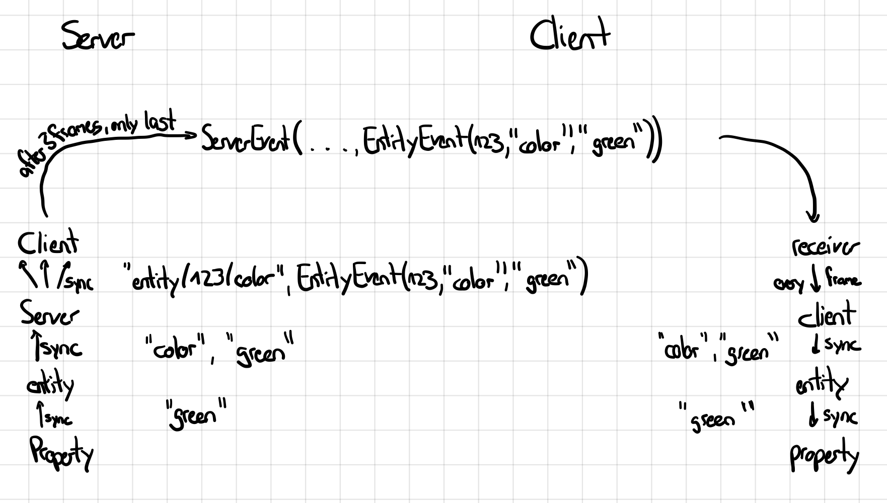
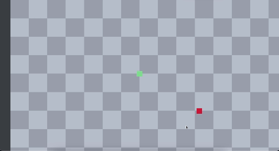

# Sprintlog 3

## Multiplayer Core

_[@p-98](https://github.com/uni-tj/robo-arena/commits?author=p-98) (Timon Martins)_

First I wanted to address the problems left in the prototype of the last sprint. I refactored large parts of it to be easier to understand and most importantly: Client and server now share common code.
This will also be helpfull later on, because this means we can also render the server game state by implementing the code on the shared classes.
The improved architecture also embraces the principle of least knowledge, as the server does not know about the data the entities exchange with each other. The following roughly shows what the event flow looks like:

I also noticed, even though the code was working correctly, the player still had some light jittering. It did some research only to find out, that this is a limitation of the pygame clock precision.
So I created another proof-of-concept, in which I compared different other methods of calculating frame times and used different clocks. After some time, I ended up with a custom clock implementation, which completely eliminated jittering.

Because the game-core prototype was still all in one file and some namings, etc. were still prototype-y, my next task was to convert the prototype to production code. This was done splitting it up into roughly a dozen files in three categories:

- client
- server
- shared (here lives code like a uniform time module and entity movements)

Whilst doing this, I also setup proper cli argument parsing and logging to be safe for the future.

The last thing I worked on, was enabling client and server to have states where no game is running, such as the main menu and the end screen for the client and the lobby for the server.
Due to some Bugs I wasn't able to finish this though, so it will be the first task in the next sprint.

## Render Engine Prototype

_[@JulesOxe](https://github.com/uni-tj/robo-arena/commits?author=JulesOxe) (Julius Oexle)_

In a meeting, it was first agreed how the render engine should be integrated into the current architecture.
The entire level is to be divided into a global coordinate system of Game Units (GU). A GU corresponds to a block and a block in turn corresponds to a graphic tile.  
Jan's WFC creates a level and returns a data structure that stores where which blocks are located.  
As the player's character should always be in the centre of the screen, the background is shifted to visualise movement.

The render engine calculates which game units are visible (Field of View FOV) from the position of the player in the global coordinate system, which corresponds to the camera position and the size of the screen. The blocks located in the FOV are taken from the data structure of the WFC and then render themselves onto the screen. Their position is converted by GU into a local coordinate system of pixels. Blocks with a 2.5D effect are moved correctly.  
In addition, a render call is called by the render engine for each entity, with the information as to which part of the global coordinate system is currently visible on the screen.
As the current data structure of the entities has not yet been finalised, each entity holds its own position, calculates whether it can be seen in the current FOV and, if so, renders itself on the screen.  
The render engine also offers the function that the screen can be resized. A value is used to define how many blocks should always be visible in the width. The standard width of a block is then used to calculate how the graphics should be scaled in order to adapt dynamically to the size of the screen.

A simple demo can already show the functions of the current prototype without final graphics:

## Level Generation

_[@weiserhase](https://github.com/uni-tj/robo-arena/commits?author=weiserhase) (Jan Keller)_

In this sprint, the area of focus was preparations for the merge of the system components (level_renderer, level_generation, and the game logic core).

For the level generation, these changes included:

- The definition of the common interface between the level generation and the level renderer. This common interface was needed so that all 3 parties could be able to prepare for the merge of the different components.

- The conversion from the tilemap output of the wave function collapse algorithm to the level representation that can be rendered by the level renderer, which takes a map (dict) and converts it into a map of blocks. The generated blocks contain information about the height and texture of the block.

- The wave function collapse algorithm was not completed in the last sprint and included several bugs and problems in the implementation. The bugs that were fixed in this sprint include a problem with the selection of the random position that is collapsed. The collapsed tile was not selected randomly of the tiles with the lowest entropy but rather a random cell. Further, I completely rewrote the system for defining tile constraints due to issues with the directionality of constraints and the effects from this.

- To improve the reliability of the system, I started to write test for the wave function collapse algorithm and the vector implementation.

## Use of AI Tool

_[@JulesOxe](https://github.com/uni-tj/robo-arena/commits?author=JulesOxe) (Julius Oexle)_

Git Copilot used to:

- auto-completion of code
- write comments to explain the code
- explain bugs and suggest possible solutions

- useful in about 7/10 cases
- for example, I calculated the top left corner of the FOV and Copilot suggested the code for the bottom right corner (simple sign change)
- sometimes error description not helpful or error correction wrong
- sometimes time-consuming to use, as the suggested code must first be analysed to see if it is useful at all

_[@p-98](https://github.com/uni-tj/robo-arena/commits?author=p-98) (Timon Martins), [@weiserhase](https://github.com/uni-tj/robo-arena/commits?author=weiserhase) (Jan Keller)_

We see these tools ciritical. When we generate our code, we end up working with code we didn't write ourself and have a worse understanding of.

Unfortunetely, in addition, we tend to spend quite some time adapting the generated code, which gets us out of our workflow.
