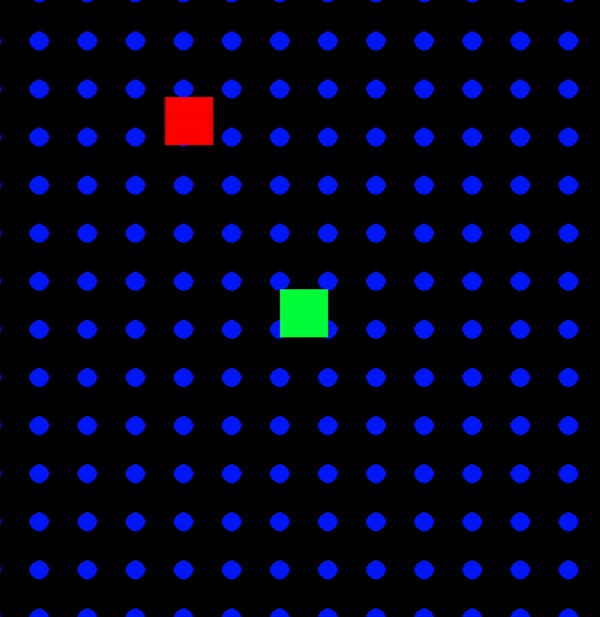
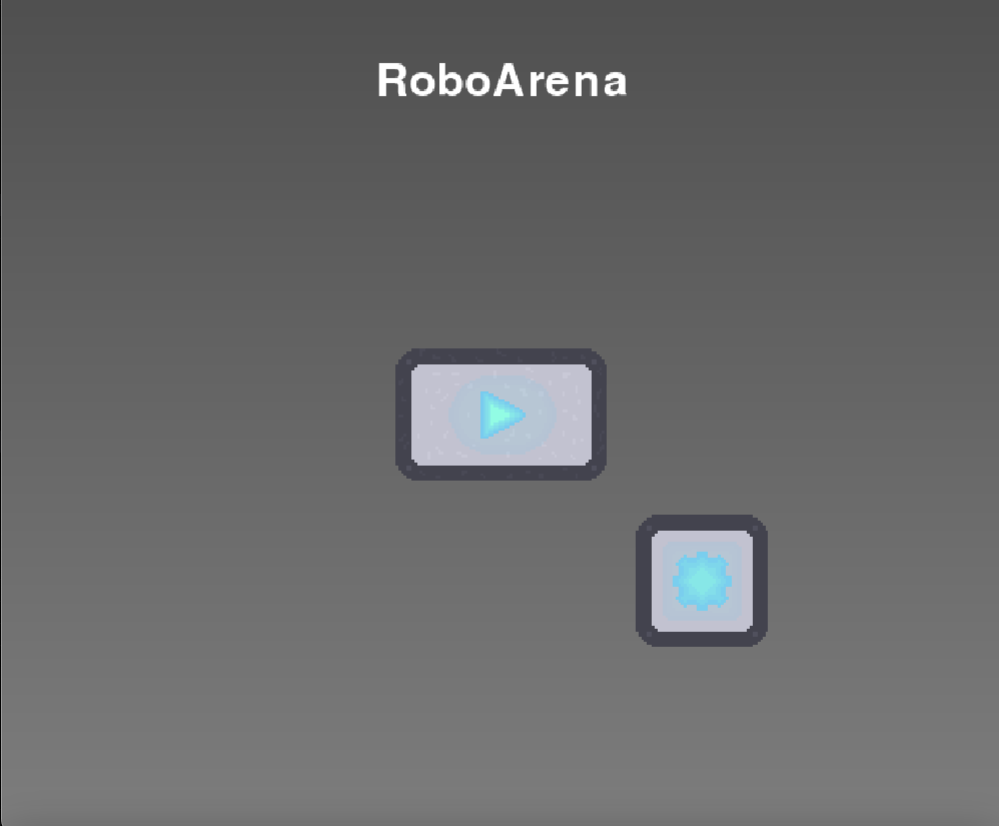
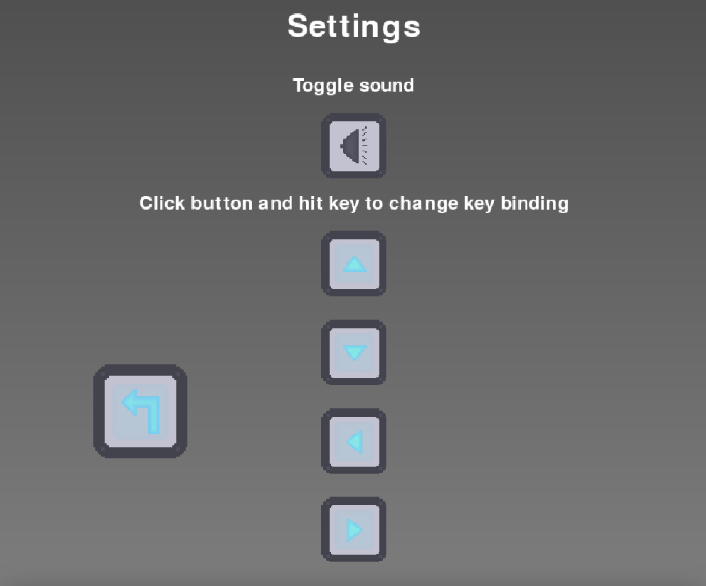

# Sprintlog 5

## Quit gracefully

_[@p-98](https://github.com/uni-tj/robo-arena/commits?author=p-98) (Timon Martins)_

Up until now there was no proper way to quit the game. The red cross of the window did nothing and one had to ctrl-c multiple times to kill the seperate threads that were running.

So I went ahead and fixed that. Technically I introduced that server, client, etc. implement the `Stoppable` interface, i.e. can be imperatively stopped by other threads.
Then, every loop, e.g. the render loop, checks on every iteration whether it was stopped. If yes, it has the opportunity to do cleanup or stop other threads before it returns the semantically special `Stopped`-instance.

To not hide the closing logic somewhere in the client, the event bubbles from `GameState` to `Client` to `index.py`, so it becomes a top-level task to stop all running instances.
For this I used our `EventTarget` class that supports registering event listeners and emitting events. Unfortunately here I spent a long time on an infinite recursion bug.  
A long story short: Use composition instead of (multiple) inheritance, because it massively obscurs the control flow, and mutable field initializers share the same instance.
This was my own hands-on experience why object-oriented and mutable programming can become dangerous fast, and definetely increased my awareness for this topic in our codebase.

## Track Mouse Position

_[@p-98](https://github.com/uni-tj/robo-arena/commits?author=p-98) (Timon Martins)_

When getting the input, now the mouse position and buttons are tracked as well.  
The challenge was to convert the screen position to the internal game grid position, which is used currently by the `PlayerRobot`, and back to the robots aim, because I had to implement the conversion functions within code not written by me. But after a little reading it worked:

With mouse tracking implemented, the ground work is laid to start working on shooting, bullets and the attack mechanic in the next sprint(s).

## Menus

_[@JulesOxe](https://github.com/uni-tj/robo-arena/commits?author=JulesOxe) (Julius Oexle)_

For our MVP, we had agreed on a simple main menu and a settings menu. You should be able to start the game and access the settings via the main menu. In the settings, you should be able to switch off the sound and change the button assignment for the controls.
Firstly, I created generic buttons and generic text fields.

Generic buttons:

- can be positioned using a relative position
- change their appearance when you move the mouse over them
- execute a function when they are clicked

Generic Textfields:

- can be positioned via a relative position
- Adjustable font size
- currently still a standard font

Multiple buttons and text fields can be managed by a menu class whose object represents a menu page. Each menu takes care of its own rendering and informs its buttons about the mouse position.

Two new functions have been developed for the settings:

- Toggle sound:
  - recognises whether the sound is currently on or off and toggles it and changes the display of the button
- Change Key Binding
  - If you click on such a button with this function, you can click on any key and this will be responsible for selected controls in future
  - The process can be cancelled with Escape
  - The key bindings are saved in a yml file and loaded when the game is started
  - even if the game is restarted, the old key bindings are still set.

A function was developed for the interface that fills a surface with a colour gradient to make the backgrounds of the menus more appealing. Customised pixel graphics were created in the app Pixquare for all buttons to show whether the mouse is on the button or not.

A current problem is that the elements of the menu scale independently, but overlap at a certain point. This would probably be difficult to solve with a dynamic grid system like in CSS, but it exceeds the amount of time that has been planned for the MVP for the menu.

## Performance Optimizations

_[@weiserhase](https://github.com/uni-tj/robo-arena/commits?author=weiserhase) (Jan Keller)_

After the merge of all prototypes in the last sprint, it became apparent that the performance of the rendering engine and level generation was not sufficient to play the game lag-free in most circumstances.

### Level Generation

To identify the problems in the rendering engine code, I added thorough profiling of all functions and their different operations. This profiling revealed that the expansion time of the level did not remain constant with a constant increase in level size, resulting in an expansion time of around 150ms for the first expansion and 1500ms after 20 expansions. This problem was caused by the need to propagate information to all tiles. This was fixed by a stepwise memorization of which tiles were affected by the last propagation step. After these changes, the level expansion time remained constant at around 150ms.
The resulting time was not fast enough if every player could expand the level around once per second. Therefore, I decided to do a complete rewrite of the level generation using a faster way to represent the constraints as numpy boolean arrays, which reduced the implication of constraints to a single for-loop over all neighbors, using the binary & and | operations. Furthermore, the rewrite included some additional changes, such as the use of an updating deque, as well as more readable and faster collapsing logic. All these changes combined reduced the total level expansion time after the rewrite to around 15-20ms, making the level generation fast enough for 2-3 expansions per server tick.

### Rendering Engine

After thorough profiling of the rendering engine, it was also apparent that rendering more than a handful of blocks resulted in quite low FPS due to the constant re-rendering of the background (because the background is scrolling behind the player). To find the issue, I profiled the code and found multiple areas for improvement. One of the improvements was the simplification of complex shifting and scaling operations in the rendering loop. After moving constant calculations out of the game loop, the performance increased by 10%.
To further increase performance, changes in the blitting of textures were needed. I tried blitting all blocks at once (by z-level, because of the 2.5D perspective shift). This resulted in a performance decrease of 30% due to the many list operations needed, even batching the draws did not fix the issue. Therefore, I conclude that the background cannot be fully rendered for every frame but must be updated properly each frame to reduce overhead.
