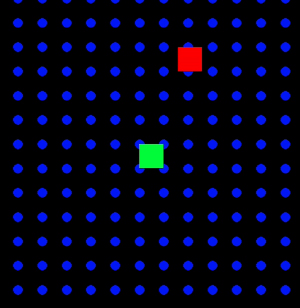
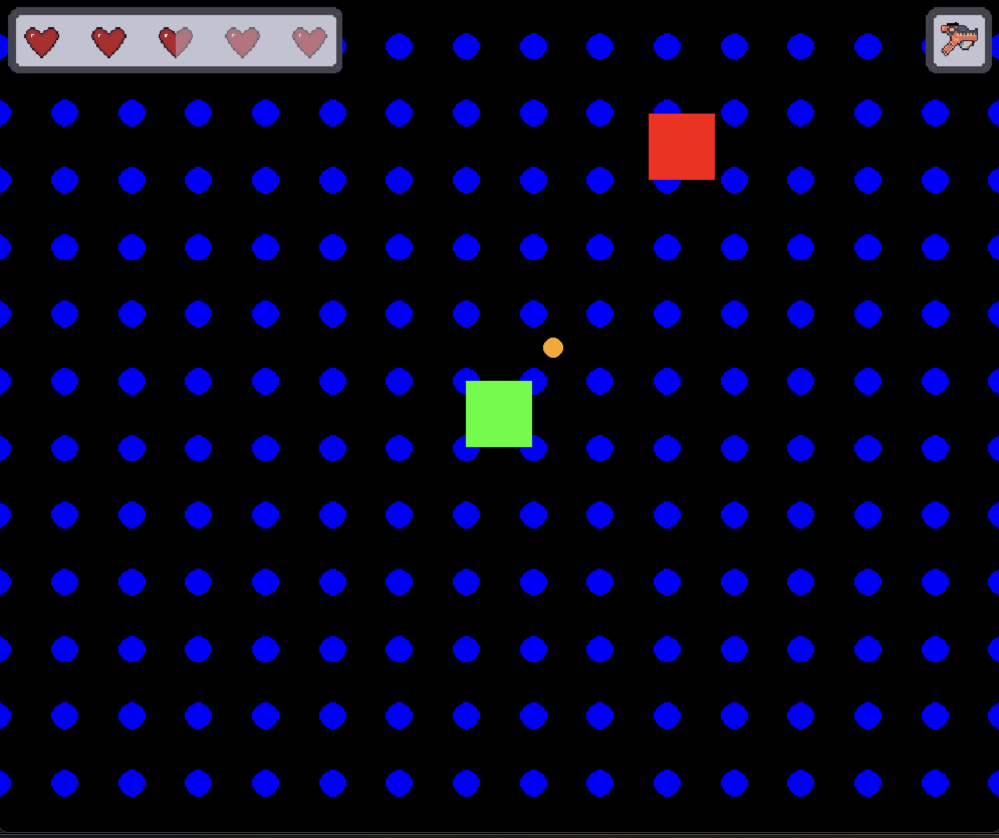

# Sprintlog 6

## Attack System

_[@p-98](https://github.com/uni-tj/robo-arena/commits?author=p-98) (Timon Martins)_

After mouse tracking, etc. were implemented, there are now two big fish: The
attack system and the logic for rooms. This sprint I tackled the first of them.
There were several components needed:

- The `PlayerBullet` is the new entity. It exists as `ClientPlayerBullet` and
  `ServerPlayerBullet` and has a `ServerSpawnPlayerBulletEvent`.
  Furthermore it is responsible for detecting collisions with enemy entities
  and dealing damage accordingly (this required some logic, because we don't
  want to hit an enemy again in the next frame if it has already been hit).

- The bullet is extrapolated on the client. That means that, once we have the
  first position of the bullet on the client, we predict the position of the
  bullet in the next frame, as it has a constant velocitiy. The code for this
  had to be written first but fortunately worked from the beginning with no problems.

- A player now carries a weapon. It contains the logic for shooting, i.e. when
  and how a bullet should be spawned

- All attackable entities now have `HealthController`. It it has the `hit` method
  used by the bullet and emits an event when the damage is too low.

To make them all work together properly, we made the convention that always the
active entity is responsible for collision detection and the resulting actions.
In this case the bullet for hitting the player.  
In Addition, I had to standardize how entities expose their hitbox to make collision
detection work and had to expose methods for creating and deleting entities on
the server game instance. Tha latter caused an unexpected bug when the length
of the entity dict changed while iterating over it, due to a dying enemy. This
is now fixed but creates mental overhead in the server class, so it might be moved
into the update logic eventually.

All in all, I am happy with the result:



## Menus Refactoring and new Rendering

_[@JulesOxe](https://github.com/uni-tj/robo-arena/commits?author=JulesOxe) (Julius Oexle)_

The amount of code has been significantly minimised and is clearer.
Timon has revised the rendering and introduced new functions and structures.
The rendering of the menu has been adapted to this and additional render functions have been developed according to the same structure to improve the rendering of the menus.
At the moment the introduced Quit functionality in the menu does not work yet, but will be fixed soon.

## Game UI

_[@JulesOxe](https://github.com/uni-tj/robo-arena/commits?author=JulesOxe) (Julius Oexle)_

The game UI consists of a healthbar and a display showing which weapon is currently selected.

Healthbar:

- maximum life can be set
- shows the current life of the player
- Full, half and empty hearts
- dynamically scalable

Weapon UI:

- Displays the currently equipped weapon
- dynamically scalable

All required graphics were custom pixelated in Pixquare again.

Game UI graphics are only updated when values are changed to save resources. Fits into the current render logic.
Is currently not yet controlled, as the combat system is still under development, but the necessary interfaces are already available.



## WFC Performance Optimizations + Bugfixes + Fps-Counter + Room Detection

_[@weiserhase](https://github.com/uni-tj/robo-arena/commits?author=weiserhase) (Jan Keller)_

This week's tasks were even more optimizations, the finalization of the optimizations started last week.

The optimizations that were implemented are lead to a decrease of average computation time by 40%.

- Batchwise Collapse: The new algorithm collapses all cells that have the lowest entropy. This is possible because the information about all possible constraints is being propagated throughout the whole (infinite grid). This means that whatever tile type we choose for one tile, this collapse cannot imply impossible constraints onto other tiles.

- Cached Constraints: The previous algorithm used to calculate the constraints implied by a specific tile every run. Therefore, the algorithm might be slow in some specific cases.
  The caching uses a unique ID for every constraint, which is calculated as follows:

  ```Python
  np.sum(2^constraint)
  ```

  This results in a unique number representing the constraint that can then be used to look up the value for the constraint. This is not perfect because the memory overhead for this cache is quite large because 2^{num_tiles} directional constraints in a dictionary need to be stored.

- Problem Fix:
  Due to the nature of this problem, there are tilesets that can generate infinite propagation of constraints. These infinite propagations are not avoidable if the tileset covers the plane forcefully, meaning there is only a partial freedom of placing tiles (e.g., chessboard tileset covers the room uniquely after one tile is collapsed, square tileset where squares are placed in the room in regular patterns, after the first placed square the tileset covers the plane uniquely). The tilesets that cause even more problems are the partially locking tilesets, meaning the tileset doesn't lock all tiles in the room but rather propagates the same constraints over the whole plane without collapsing a single tile.

  These tilesets cause problems because they are not detectable, and there is no way of knowing if the propagation will halt. Therefore, I employed a trick to stop this infinite propagation. The trick only lets constraints propagate a finite distance from the currently collapsed tile. This solves the infinite propagation problem, but therefore, there might be cases where we create impossible tile situations where no tile can fit.

  The best compromise is to use a margin distance, of 2 - 2.5 times the number of tile types (or around 12-20 for the example tileset), around the currently collapsed tiles.

- Problem Fix:
  Furthermore there was an issue with the expansion of the level causing corner case issues when constraint are overridden leading to propagation order corruption after multiple propagation steps. This issue caused a lot of Problems and required a lot of debugging and time because of the hidden error.

- Rendering Engine FPS Counter:
  To better analyze and track the performance of the rendering/game, I introduced an FPS counter/display to display the current frames per second as well as the 5th and 95th percentile FPS values, giving a good indicator for lag spikes.

- Preparations for the Room Controller:
  To control the Doors and Enemies in a room the detection of which part of the level belong to which room is needed the basics for this were implemented.
