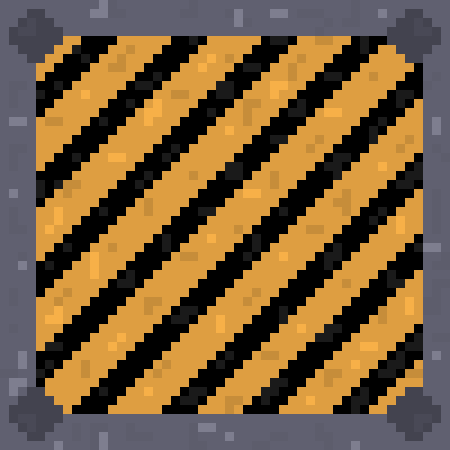
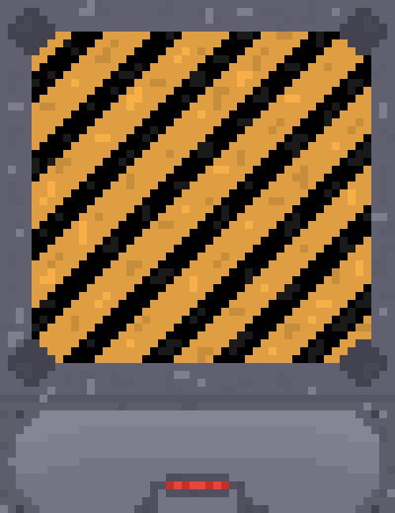

## Bullet-Textures

_[@JulesOxe](https://github.com/uni-tj/robo-arena/commits?author=JulesOxe) (Julius Oexle)_

I have designed two new graphics for an Alien projectile and a Laser Gun projectile.
I used the Pixquare app again for this.
When choosing the colours for the two projectiles, I made sure that they are easy to distinguish and that they stand out clearly from the background.

## Smooth-Player-Movement

_[@JulesOxe](https://github.com/uni-tj/robo-arena/commits?author=JulesOxe) (Julius Oexle)_

An acceleration and deceleration model has been added so that the player no longer moves by a certain value with each key input. 
The player now accelerates smoothly up to a maximum speed on key input and then decelerates smoothly again.
The values were chosen so that the control feels smooth but direct. For example, to prevent the player from ‘slipping’ for a long time, it is brought to a standstill at a minimum speed.

## Smooth-Camera-Movement

_[@JulesOxe](https://github.com/uni-tj/robo-arena/commits?author=JulesOxe) (Julius Oexle)_

In order to offer a smoother gaming experience, the camera position is no longer exactly the player's position. This means that the FOV no longer moves jerkily with the player's movements. The camera now follows the player's movement with some delay, which provides a more pleasant gaming experience.

## Sounds

_[@JulesOxe](https://github.com/uni-tj/robo-arena/commits?author=JulesOxe) (Julius Oexle)_

Sound is an important component in the quality of a game. It fills the game with life and gives the player feedback on what is happening in the game. That's why it was important to us that there is background music in the game and that actions trigger sounds.

All sounds and music are from [Pixabay](https://pixabay.com/sound-effects/). There you can get a large selection of free sounds and pieces of music without the need for a licence or attribution.
If sounds were too long or had unwanted components, they were cut using the [Clideo](https://clideo.com/de/cut-audio) website.

A central master mixer module controls the playback of music and sounds in the game. Other modules that want to play music and sounds can use the interface functions provided by the module. We have opted for a central module so that it is known centrally whether the sound output has been muted in the settings and so that sounds do not overlap unintentionally or cause bugs in the pygame mixer module.

- Menu: Background music is played, if you hover over the buttons or click on them, a feedback sound is played and if new button assignments are successfully set, this is also confirmed by a sound. The mute button in the settings now recognises whether the sound output is muted or not and indicates this with its graphic and toggles the sound output when it is clicked.

- Game ambience: When the game is started, music starts to play in the background. The system switches permanently between two songs.
Every 20 seconds a random decision is made as to whether an ambience sound should be played in the background (random selection from 10 possible sounds) or not.

All subsequent sounds are triggered via an event system so that it is not necessary to check for each main loop run whether the sounds need to be played. The function for playing the sounds is only triggered when the event occurs.

- Player Sounds: Feedback sounds are played when the player runs, shoots, gets hit or dies.

- Enemy Sounds: Feedback sounds are played when the aliens hover, shoot, get hit or die.

- Door sounds: Doors play a feedback sound when they close or open.

Once all the sounds had been implemented, the volume of all the sounds and music was adjusted so that they harmonised with each other.

## Player-Animation

_[@JulesOxe](https://github.com/uni-tj/robo-arena/commits?author=JulesOxe) (Julius Oexle)_

New textures have been pixelated to show the player's leg movement. A new function recognises the player's direction of movement and changes the current texture to render in such a way that an animation is created. The animation makes the game look more realistic and improves the gaming experience.

## Enemy-Animation

_[@JulesOxe](https://github.com/uni-tj/robo-arena/commits?author=JulesOxe) (Julius Oexle)_

New textures have been pixelated to show the enemys tentacles movement. A new function recognises the enemys movement and changes the current texture to render in such a way that an animation is created. The animation makes the game look more realistic and improves the gaming experience.

## New Textures and Resolution

_[@JulesOxe](https://github.com/uni-tj/robo-arena/commits?author=JulesOxe) (Julius Oexle)_

Since the textures for the doors no longer fitted, as doors in the current realisation are not just one block wide, but three, new textures had to be created to represent a closed door and an open door.
In addition, the resolution of all textures has been scaled up by a factor of 10. However, this is not necessary in our realisation of the rendering and therefore all textures were created again without scaling so that the files are smaller and the textures load faster. 
In addition, all superfluous transparent borders were removed from the textures.

## UI-Connection 

_[@JulesOxe](https://github.com/uni-tj/robo-arena/commits?author=JulesOxe) (Julius Oexle)_

The UI has been connected to the player's health controller and now displays the player's correct current health status.
It has been defined that one health point means half a heart. As the UI is currently expanded to 5 hearts, the player can have a maximum life of 10 health points.

## Game-Title & Menu-Font

_[@JulesOxe](https://github.com/uni-tj/robo-arena/commits?author=JulesOxe) (Julius Oexle)_

After a brainstorming session, we decided on the game title ‘Infinitum’, as the core feature of our game is the infinite level generation, which generates a new unique level each time and thus provides endless fun.
The title is now on the start screen of the menu.
In addition, a free, licence-free font was selected from the website [1001 FONTS]("https://www.1001fonts.com/"), which is kept in pixel style to make the menu look more appealing.

## Constants & Types Cleanup

_[@JulesOxe](https://github.com/uni-tj/robo-arena/commits?author=JulesOxe) (Julius Oexle)_

To make the code clearer, more readable and easier to maintain, all constants and types have been collected in a single file.
This has the following advantages:
- there are no magic numbers in the code, for example to indicate the position of a button, but a variable with an understandable name
- if, for example, you want to standardise the sound volume of all sounds, you do not have to search for all defined volume levels individually in the code, but can set them centrally in the constants file or if, for example, the file name of a graphic changes, this can also be changed centrally.
- a centralised types file makes it easier to prevent cyclomatic imports

## ENDSCREEN

_[@JulesOxe](https://github.com/uni-tj/robo-arena/commits?author=JulesOxe) (Julius Oexle)_

When the player dies, an end screen is displayed. A new menu screen has been designed for this purpose.
The final score is displayed on the final screen. This is calculated by the maximum distance the player had to the start centre.

