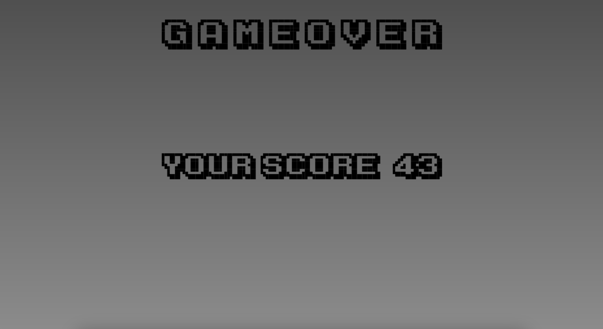

# Sprintlog 7

## Bullet-Textures

_[@JulesOxe](https://github.com/uni-tj/robo-arena/commits?author=JulesOxe) (Julius Oexle)_

I have designed two new graphics for an Alien projectile and a Laser Gun projectile.
I used the Pixquare app again for this.
When choosing the colours for the two projectiles, I made sure that they are easy to distinguish and that they stand out clearly from the background.


## Smooth-Player-Movement

_[@JulesOxe](https://github.com/uni-tj/robo-arena/commits?author=JulesOxe) (Julius Oexle)_

An acceleration and deceleration model has been added so that the player no longer moves by a certain value with each key input.
The player now accelerates smoothly up to a maximum speed on key input and then decelerates smoothly again.
The values were chosen so that the control feels smooth but direct. For example, to prevent the player from ‘slipping’ for a long time, it is brought to a standstill at a minimum speed.


## Smooth-Camera-Movement

_[@JulesOxe](https://github.com/uni-tj/robo-arena/commits?author=JulesOxe) (Julius Oexle)_

In order to offer a smoother gaming experience, the camera position is no longer exactly the player's position. This means that the FOV no longer moves jerkily with the player's movements. The camera now follows the player's movement with some delay, which provides a more pleasant gaming experience.


## Level Generation Rewrite ([#55](https://github.com/uni-tj/robo-arena/pull/55))

_[@p-98](https://github.com/uni-tj/robo-arena/commits?author=p-98) (Timon Martins)_, _[@weiserhase](https://github.com/uni-tj/robo-arena/commits?author=weiserhase) (Jan Keller)_

I (Timon) wanted to get away from the endless void, i.e. create a proper tileset for
the level generation, which Jan wrote. It was already quite optimized, but the
code was quite prototype-ish, beeing hard to understand and most importantly
hard to use.

So I started a full production-ready rewrite significantly shortening code and
clearing up interfaces. I introduced the clear distinction between `WFC`, the
raw implementation of the wave function collapse algorithm which is heavily
optimized, and the `LevelGenerator`, the adapter to the rest of the game requiring
a `Tileset` which contains all the information neccesary to generate a level.  
But as it is when refactoring complex code, when finished it didn't work first try.

So I am happy Jan joined me as the original author and together made it work.
To find all bugs we had to develop a seperate tool found in `wfc_test.py`, which
can print the whole wfc state graphically and through every single propagation step
in different granularities. After everything was working, the performance kept
up with pre-rewrite but was still not good enough. So...

## WFC Optimization

After Timon's refactor/rewrite, there were multiple issues with performance. To
address these issues, the first step was to properly diagnose the performance
impact.

### Performance Optimizations

_[@weiserhase](https://github.com/uni-tj/robo-arena/commits?author=weiserhase) (Jan Keller), [@p-98](https://github.com/uni-tj/robo-arena/commits?author=p-98) (Timon Martins)_

### Idle Performance

The first major bottleneck was idle performance. Even when the map was not
expanded, there was significant time spent re-adding already existing tiles.
This was optimized by storing all TilePositions that were already passed into
the WFC as an argument. This brought down the idle performance to less than one
millisecond.

### Low Entropy Calculation

The second problem was the calculation/selection of tiles with low entropies,
which ran for around 30% of the time spent in the WFC. This was eliminated by
using an Entropy store that is updated on every update to always keep track of
the elements, instead of iterating over all positions every collapse.
Position Calculations
One bottleneck that became obvious quite fast was the calculation of positions
around another position. This function was working with the internal Vector
class. After utilizing the Performance Tester, it became clear that working with
tuples instead of vectors, np arrays, or other reference-based objects was much
faster for all calculations (3x increase in arithmetic operations speed).
The utilization of tuples and other optimizations resulted in the new function
being 2.59 times faster than the old function, further improving the speed of
the WFC.

#### Vector operations

```
+--------------+-----------+-----------+-----------+-----------+
| Label        | avg       | std       | min       | max       |
+--------------+-----------+-----------+-----------+-----------+
| tuple np_int |  0.475 µs |  1.294 µs |  0.400 µs |  0.349 ms |
| nparray      |  1.349 µs |  2.019 µs |  1.100 µs |  0.517 ms |
| tuple int    |  0.478 µs |  0.465 µs |  0.400 µs |  0.102 ms |
| vector       |  1.039 µs |  0.975 µs |  0.900 µs |  0.124 ms |
+--------------+-----------+-----------+-----------+-----------+
```

#### coordinate generation/transformations

```
+-----------+-----------+-----------+-----------+----------+
| Label     | avg       | std       | min       | max      |
+-----------+-----------+-----------+-----------+----------+
| old       | 31.487 ms | 33.200 ms | 11.200 µs |  0.189 s |
| fast_gen  | 12.154 ms | 12.537 ms | 10.300 µs |  0.130 s |
| fast_comp | 12.406 ms | 13.052 ms | 11.300 µs |  0.116 s |
| fast      | 13.153 ms | 16.568 ms | 16.600 µs |  0.255 s |
+-----------+-----------+-----------+-----------+----------+
```

### Constraint Representation

The last optimization replaced numpy vectors with integers for constraint
calculations. Constraints are now encoded with each tile represented by a bit in
the integer. This doesn't cause any problems since Python 3 integers are not
directly fixed in size. The switch to integers resulted in the biggest
performance improvement, as integers are stored on the stack and bitwise
operations are faster than their array equivalents.
To ensure correctness, unit tests for all bitwise helper functions are included
in "tests/bitwise_operations_tests.py". Performance tests using the added
Performance Tester framework are also included in "perf_tests/bittest.py".
All these improvements led to a reduction in average non-idle WFC collapse time
from 14.2 ms to around 3 ms per collapse.

```
+---------------+-----------+-----------+-----------+-----------+
| Label         | avg       | std       | min       | max       |
+---------------+-----------+-----------+-----------+-----------+
| nd_arr2int    |  6.660 µs |  3.903 µs |  6.000 µs |  3.563 ms |
| one_hot       |  0.345 µs |  1.334 µs |  0.200 µs |  2.156 ms |
| int2nd_arr    |  4.508 µs |  3.633 µs |  4.000 µs |  3.894 ms |
| ones_except   |  0.498 µs |  0.835 µs |  0.300 µs |  1.690 ms |
| nonzero       |  2.321 µs |  2.926 µs |  0.900 µs |  3.575 ms |
| nonzero_inv   |  0.621 µs |  1.162 µs |  0.300 µs |  2.787 ms |
| is_one_at     |  0.402 µs |  0.946 µs |  0.300 µs |  2.707 ms |
| nonzerop      |  1.742 µs |  1.729 µs |  0.400 µs |  2.459 ms |
| nonzero_count |  1.259 µs |  1.931 µs |  0.300 µs |  3.126 ms |
| ones          |  0.337 µs |  1.229 µs |  0.200 µs |  2.813 ms |
+---------------+-----------+-----------+-----------+-----------+
```

## Debugging Utilities

_[@weiserhase](https://github.com/uni-tj/robo-arena/commits?author=weiserhase) (Jan Keller)_

### Progress Bar

To easily show the current progress of complex calculations, a Progress Bar was
added to display the progress of performance tests and other complex operations.

### Stats/StatsCollection

The Stats collection provides a basic framework for easy and modular printing
and analysis of data series statistics. It was introduced in two steps: first
with the Performance Tester, and then refactored for better usability and
modularity when introducing the Timer.

### Performance Tester

To find more bottlenecks and analyze function runtime, a new PerformanceTester
was introduced to produce reproducible results. It's designed for easy testing
of different functions' performance, using a general data generation function
and individual data transformation functions to ensure fair comparisons.

### Timer Framework

The Timer framework is a debugging tool to analyze the runtime of different
parts of the code. It can be used by calling Timer.tick("label") to start a time
measurement and Timer.end_tick() to end the last tick. It also provides a
framework to print periodically for repeated function calls.

## Tileset ([#65](https://github.com/uni-tj/robo-arena/pull/65))

_[@p-98](https://github.com/uni-tj/robo-arena/commits?author=p-98) (Timon Martins)_

After the level generation was now easier to use, I was able to replace the
debug tileset by something more interesting.

To make it possible to focus on the creative part I needed some helpers:

- Generate which tile can appear next to which other automatically solely based
  on wether there is corridor touching or not.
- Rotate tiles, otherwise code duplication would be going crazy.

Then I was finally able create the new tileset: crosses, ts, corners and dead ends
in all rotations, 25x25 blocks in size and with a 50% chance to spawn a room.
Removing a category of tiles is now as simple as commenting out a line in `tileset.py`.

Finally, I implemented predefining certain tile, so that the player never spawns
in a room but on a 4-way cross, leaving him all options.

## Renderer Improvements

_[@weiserhase](https://github.com/uni-tj/robo-arena/commits?author=weiserhase) (Jan Keller)_

The rendering performance was critical for the game. Several optimizations were
implemented:

Replaced Vector calculations with simpler arithmetic in frequently used
locations, resulting in a 40% performance increase.
Replaced individual block blitting with row-based rendering, improving
performance by about 10%.
Fixed a bug where the player was rendered above walls instead of behind them.
Introduced a smooth camera that follows the player with a slight lag,
significantly improving the game feel.

These improvements led to a 90-120% increase in rendering performance,
depending on the platform.

## Movement & Collision

_[@p-98](https://github.com/uni-tj/robo-arena/commits?author=p-98) (Timon Martins)_

With the framework from last sprint it was easy to create a simple wall collision.
But we noticed it was practically impossible to hit a 1 block wide gap, as
moving diagonally against a wall just made you stop.

So I reworked the movement system once again: If we now moved into a block,
we would instead to apply x/y movement one after another, which enables us
to slide along the walls when moving diagonally against it!  
Along the way, I also changed the orientation to a real velocity and generated
an acceleration from the input. So here we have a more capable, more physics-like
movement while not being longer and easier to read.

At this point we had several moving entities with different movement logic. To
keep code duplication at a minimum and the movement functions short, I introduced
`blocks_bullet` and `blocks_robot` on all entities and blocks along with a
function to check whether a robot/bullet is allowed to be at a certain position.
This turned out useful at the latest when implementing doors.

## Events

_[@p-98](https://github.com/uni-tj/robo-arena/commits?author=p-98) (Timon Martins)_

The sound system of course needs some triggers, so one of my tasks was make all
those events available on client: moving, shooting, getting hit and dying.

What is a short paragraph here was some work for some, as weapon and health
were currently not synced to the client.

## Sounds

_[@JulesOxe](https://github.com/uni-tj/robo-arena/commits?author=JulesOxe) (Julius Oexle)_

Sound is an important component in the quality of a game. It fills the game with life and gives the player feedback on what is happening in the game. That's why it was important to us that there is background music in the game and that actions trigger sounds.

All sounds and music are from [Pixabay](https://pixabay.com/sound-effects/). There you can get a large selection of free sounds and pieces of music without the need for a licence or attribution.
If sounds were too long or had unwanted components, they were cut using the [Clideo](https://clideo.com/de/cut-audio) website.

A central master mixer module controls the playback of music and sounds in the game. Other modules that want to play music and sounds can use the interface functions provided by the module. We have opted for a central module so that it is known centrally whether the sound output has been muted in the settings and so that sounds do not overlap unintentionally or cause bugs in the pygame mixer module.

- Menu: Background music is played, if you hover over the buttons or click on them, a feedback sound is played and if new button assignments are successfully set, this is also confirmed by a sound. The mute button in the settings now recognises whether the sound output is muted or not and indicates this with its graphic and toggles the sound output when it is clicked.

- Game ambience: When the game is started, music starts to play in the background. The system switches permanently between two songs.
  Every 20 seconds a random decision is made as to whether an ambience sound should be played in the background (random selection from 10 possible sounds) or not.

All subsequent sounds are triggered via an event system so that it is not necessary to check for each main loop run whether the sounds need to be played. The function for playing the sounds is only triggered when the event occurs.

- Player Sounds: Feedback sounds are played when the player runs, shoots, gets hit or dies.

- Enemy Sounds: Feedback sounds are played when the aliens hover, shoot, get hit or die.

- Door sounds: Doors play a feedback sound when they close or open.

Once all the sounds had been implemented, the volume of all the sounds and music was adjusted so that they harmonised with each other.

## Player-Animation

_[@JulesOxe](https://github.com/uni-tj/robo-arena/commits?author=JulesOxe) (Julius Oexle)_

New textures have been pixelated to show the player's leg movement. A new function recognises the player's direction of movement and changes the current texture to render in such a way that an animation is created. The animation makes the game look more realistic and improves the gaming experience.

## Enemy-Animation

_[@JulesOxe](https://github.com/uni-tj/robo-arena/commits?author=JulesOxe) (Julius Oexle)_

New textures have been pixelated to show the enemys tentacles movement. A new function recognises the enemys movement and changes the current texture to render in such a way that an animation is created. The animation makes the game look more realistic and improves the gaming experience.

## Rooms

_[@p-98](https://github.com/uni-tj/robo-arena/commits?author=p-98) (Timon Martins)_, _[@weiserhase](https://github.com/uni-tj/robo-arena/commits?author=weiserhase) (Jan Keller)_

The big missing piece now were the rooms. They spawn when `floor_room_center` is
generated together with their doors. For now, they spawn a single enemy upon
entering, which will later be refined by Jan, and close/open their doors accordingly.
Doors are implemented as entities as they are dynamic, so shared/client/server
variants had to be created. The event system turned out useful when connecting
rooms to the other entities.  
Here, Timon created the entities and most of the logic, with the oversight of Jan,
who worked the utility and improved the performance.

## New Textures and Resolution

_[@JulesOxe](https://github.com/uni-tj/robo-arena/commits?author=JulesOxe) (Julius Oexle)_

Since the textures for the doors no longer fitted, as doors in the current realisation are not just one block wide, but three, new textures had to be created to represent a closed door and an open door.
In addition, the resolution of all textures has been scaled up by a factor of 10. However, this is not necessary in our realisation of the rendering and therefore all textures were created again without scaling so that the files are smaller and the textures load faster.
In addition, all superfluous transparent borders were removed from the textures.


## UI-Connection

_[@JulesOxe](https://github.com/uni-tj/robo-arena/commits?author=JulesOxe) (Julius Oexle)_

The UI has been connected to the player's health controller and now displays the player's correct current health status.
It has been defined that one health point means half a heart. As the UI is currently expanded to 5 hearts, the player can have a maximum life of 10 health points.

## Enemy AI

_[@weiserhase](https://github.com/uni-tj/robo-arena/commits?author=weiserhase) (Jan Keller)_

To make the game engaging, an Enemy AI was developed over multiple iterations:

Initial version used A\* pathfinding and player repulsion, but had issues with
dodging bullets and avoiding obstacles.
Second iteration introduced a force-based design with wall and entity
repulsion, improving behavior but suffering from performance issues.
Final version pre-calculates wall force gradients and uses cubic
interpolation for efficient access, balancing performance and behavior.

The shooting algorithm uses Newton approximations to predict player-bullet
intersections. A difficulty scaling system was also implemented, making the game
harder as the player progresses.

## Perlin Noise Obstacles

_[@weiserhase](https://github.com/uni-tj/robo-arena/commits?author=weiserhase) (Jan Keller)_

To reduce repetitiveness, obstacles are placed throughout rooms using Perlin
noise. Optimizations were made to ensure efficient generation of these
obstacles.

```
+-------------+----------+----------+----------+----------+
| Label       | avg      | std      | min      | max      |
+-------------+----------+----------+----------+----------+
| perl_mp     |  5.300 s |  0.243 s |  4.983 s |  5.880 s |
| perl        | 37.357 s |  1.648 s | 35.832 s | 41.125 s |
| perl_mp_inv |  7.191 s |  1.128 s |  6.424 s | 10.179 s |
+-------------+----------+----------+----------+----------+
```

## Game-Title & Menu-Font

_[@JulesOxe](https://github.com/uni-tj/robo-arena/commits?author=JulesOxe) (Julius Oexle)_

After a brainstorming session, we decided on the game title ‘Infinitum’, as the core feature of our game is the infinite level generation, which generates a new unique level each time and thus provides endless fun.
The title is now on the start screen of the menu.
In addition, a free, licence-free font was selected from the website [1001 FONTS]("https://www.1001fonts.com/"), which is kept in pixel style to make the menu look more appealing.

## Constants & Types Cleanup

_[@JulesOxe](https://github.com/uni-tj/robo-arena/commits?author=JulesOxe) (Julius Oexle)_

To make the code clearer, more readable and easier to maintain, all constants and types have been collected in a single file.
This has the following advantages:

- there are no magic numbers in the code, for example to indicate the position of a button, but a variable with an understandable name
- if, for example, you want to standardise the sound volume of all sounds, you do not have to search for all defined volume levels individually in the code, but can set them centrally in the constants file or if, for example, the file name of a graphic changes, this can also be changed centrally.
- a centralised types file makes it easier to prevent cyclomatic imports

## Endscreen

_[@p-98](https://github.com/uni-tj/robo-arena/commits?author=p-98) (Timon Martins)_, _[@JulesOxe](https://github.com/uni-tj/robo-arena/commits?author=JulesOxe) (Julius Oexle)_

Unfortunetely, we realized very late we don't do anything when the player dies.  
I (Timon) implemented a proper protocoll for ending a game. In addition I tried to restart
the game after the player presses the play button in the menu again, but there
were some bugs with the network in some successive runs, so we wouldn't be able
to finish this in time.  
As an alternative, we now use the protocoll to show the player a proper end
screen, which was created by Jules, displaying their reached score, i.e. how far
from the player has come from the start.



## Code quality

_[@p-98](https://github.com/uni-tj/robo-arena/commits?author=p-98) (Timon Martins)_

Because everyone's priority is to make features work first, I made put work into
refactorings to keep the quality, and therefore our ability to further extend it, high.

- Removed inheritance structure for `Block`s and make every block type have exactly
  one instance, which is the most efficient.
- Rewrote the level generation as described above
- Cleaned up ambient sound code to be shorted and easier to understand.
  When refactoring I generally tried to remove `update_...` functions which had
  no other job than updating a value, which were sometimes unclear where to be
  called from, and replace it by patterns based on cached properties
  (computations on demand) or event based patterns.

## Miscellaneous Fixes

_[@weiserhase](https://github.com/uni-tj/robo-arena/commits?author=weiserhase) (Jan Keller)_

The frame cache, written by Timon, was experiencing significant performance
issues. After using the PerformanceTester, the problem was traced to the @wraps
decorator. Removing it improved performance substantially.

```
+-----------+-----------+-----------+-----------+-----------+
| Label     | avg       | std       | min       | max       |
+-----------+-----------+-----------+-----------+-----------+
| functools |  0.876 µs |  1.517 µs |  0.200 µs |  2.873 ms |
| frame2    |  7.120 µs |  7.170 µs |  1.900 µs |  6.392 ms |
| frame     |  1.255 µs |  4.032 µs |  0.780 µs |  3.648 ms |
+-----------+-----------+-----------+-----------+-----------+
```

Continuous Integration
A GitHub Action was added to automatically build the Python script when a PR is
merged onto the main branch, ensuring consistent builds.

_[@p-98](https://github.com/uni-tj/robo-arena/commits?author=p-98) (Timon Martins)_

The server had a network receiver running a busy loop in a seperate thread,
causing out cpu usage to be constantly at 100%. The seperate thread was removed.

With an infinite level, what happens when an bullet moves out of the generated
area? Well, it crashes. Unless you prevent it from doing so, which I now did by
deleting them, as there's nothing to hit anyways.

To remove some jittering, especially in movement direction, we now use a custom clock
which is significantly more precise than the pygame one. This results in more
stable frame times and is surprisingly noticable.

And, of course, several bug fixes where made, like a crash when shooting while
standing inside of an enemy.

## Playtest & Fine Tune

_[@p-98](https://github.com/uni-tj/robo-arena/commits?author=p-98) (Timon Martins)_, _[@JulesOxe](https://github.com/uni-tj/robo-arena/commits?author=JulesOxe) (Julius Oexle)_, _[@weiserhase](https://github.com/uni-tj/robo-arena/commits?author=weiserhase) (Jan Keller)_

In the end, when everything is ready, you must playtest and fine tune all the
parameters in order for a game to actually be fun. So we did just that and are
vera happy to present you a game we actually enjoy ourselves.

Have fun!